# Project Title

**Hireme**

## Overview

Hireme simplifies and enhances the job application process for job seekers.

### Problem

Have you wondered why even after applying to numerous jobs you didn't get the interview you wanted? The culprit is often the (ATS) Applicant Tracking System that filters resumes by keywords.

> _A staggering 99% of Fortune 500 companies, 70% of large companies, and 20% of medium and small-sized companies use ATS_.

making job hunting even more challenging. This process can be one of the most stressful experiences, especially for recent graduates or those re-entering the workforce. Crafting a compelling resume and cover letter is very important, yet many of us struggle with it.

**Hireme** addresses these challenges with a versatile tools designed to support every aspect of the job application process, ensuring your efforts are recognized and rewarded.

### User Profile

**Job Seekers:**

- Create compelling resumes and cover letters using the easy to use builder tool.
- Enhance resume and cover letter tailored to job description.
- Engage with a supportive community to share job application journeys and receive encouragement or feedback with industry professionals.
- Track and organize job applications, updating statuses to stay organized.
- Appreciate a clean and intuitive UI.

### Features

- As a user, I want to be able to have my **personal private workspace and account** to protect my privacy.

- As a user, I want to be able to **interact with a clean and uncluttered interface** that allows me to easily find and complete tasks without distractions.

- As a user, I want to be able to **manage my documents** easily by viewing in real-time, filter, sort, search, and paginate drafted documents.

- As a user, I want to be able to **share post my resume and cover letter in the public** to get feedback from the community.

- As a user, I want to be able to **interact with other job seekers** by upvoting, downvoting, and commenting on user posts.

- As a user, I want to be able to **create resumes and cover letters** using an intuitive builder tool.

- As a user, I want to be able to distuingish if my resume is tailored to the job description by using **AI Enhancer** to analyze and improve resumes based on job descriptions.

- As a user, I want to be able to **track job applications** with an interactive table and I can easily update application statuses.

- As a user, I want to **organizes my job application lists** to stay on top of my job search progress.

## Implementation

### Tech Stack

**React Framework:**

- Next.js

**Front-End:**

- React
- TypeScript
- TailwindCSS
- Shadcn-UI Library

**Database:**

- Convex

**Authentication:**

- Clerk

**Generative AI Model:**

- OpenAI API

**Client Libraries:**

- Framer Motion (animation)
- React-PDF/renderer (PDF renderer)
- PDFJS (PDF conversion)
- Lucide React (icons)
- React Hook Form (form library)
- Zod (form validation)
- Zustand (global state management)
- Tanstack React-Table (table component)
- EmailJS (email service)

**Deployment:**

- Vercel

### APIs

- OpenAI API
- Clerk
- Convex
- EmailJS

### Sitemap

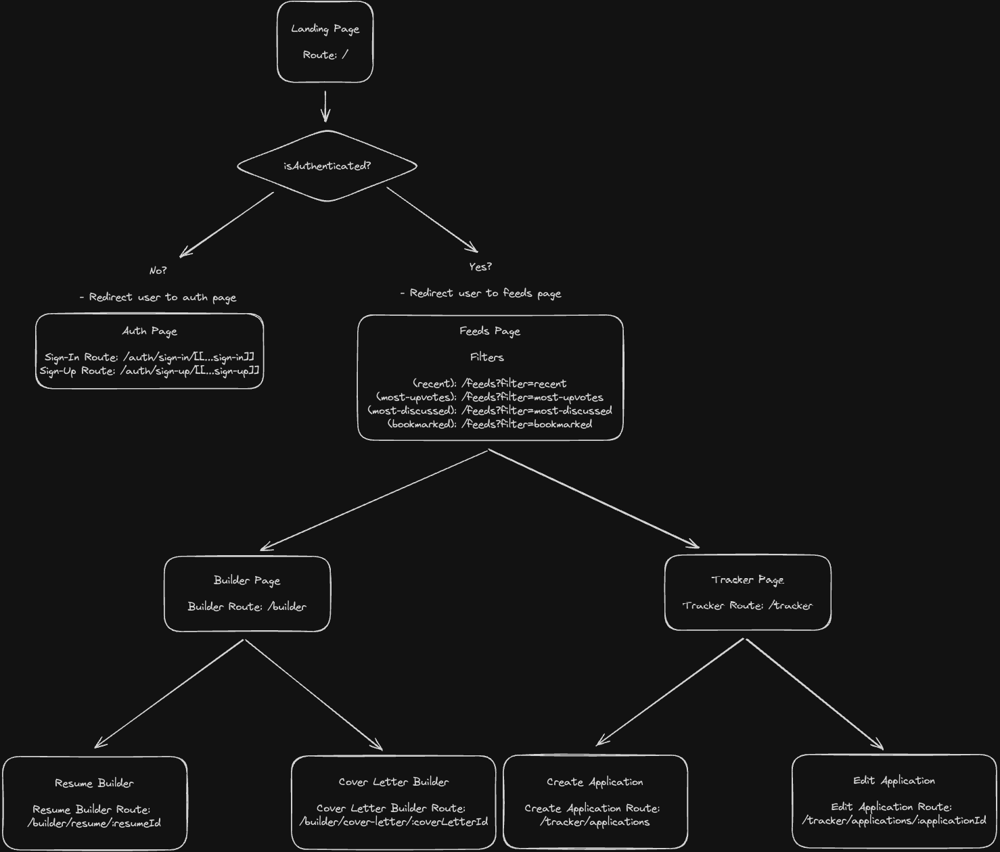

### Mockups

#### Landing Page

- **Header & Hero**
  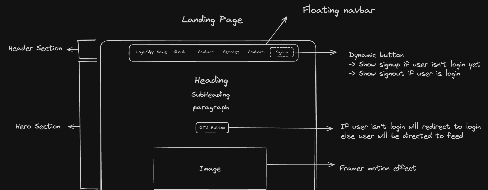

- **Features**
  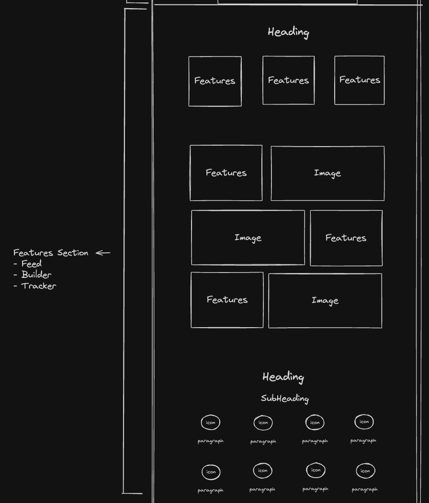

- **Call to Action (CTA)**
  

- **Footer**
  

#### Feeds Page

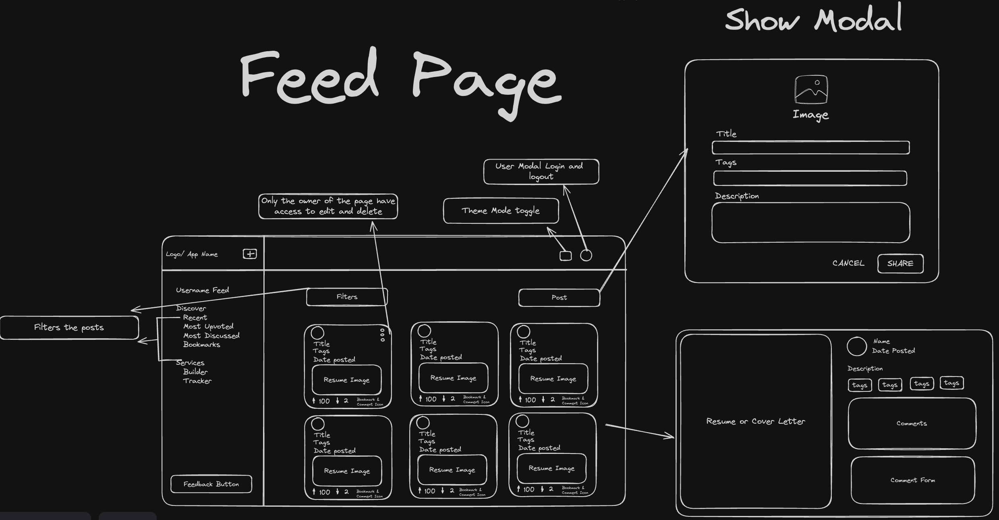

#### Builder Page

- **Builder Main Page**
  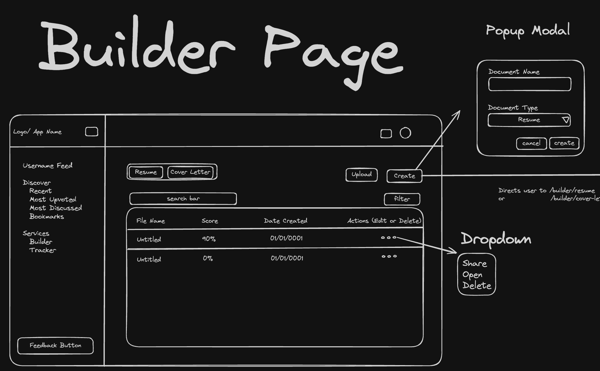

- **Resume Builder Main Page**
  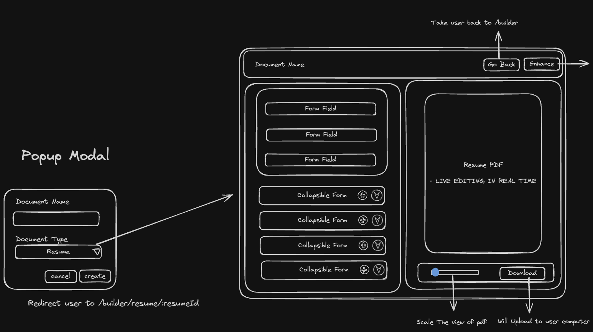

- **Cover Letter Builder Main Page**
  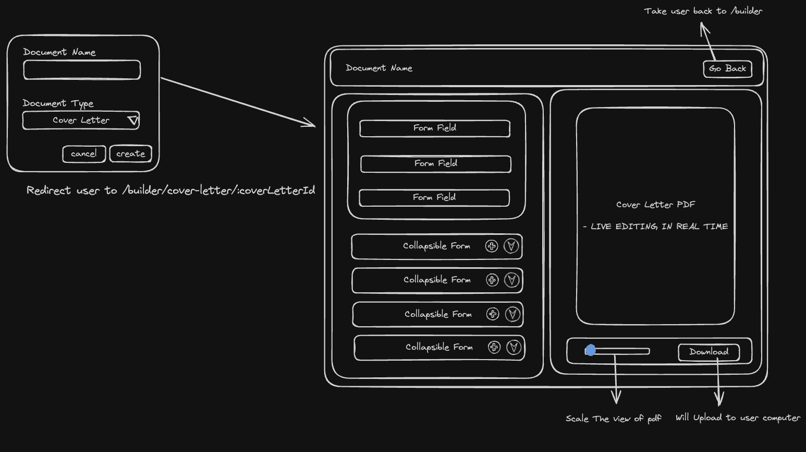

- **Enhancer Tab**
  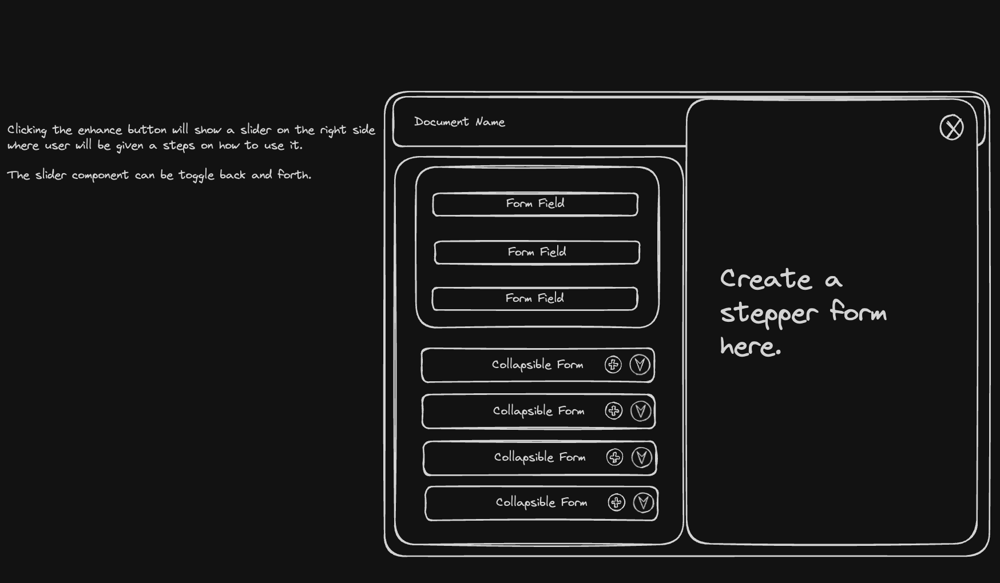

- **Stepper Form**
  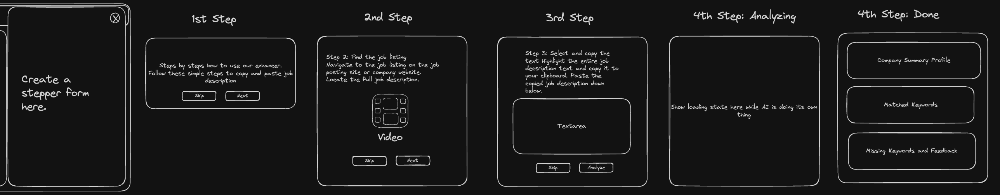

#### Job Tracker Page

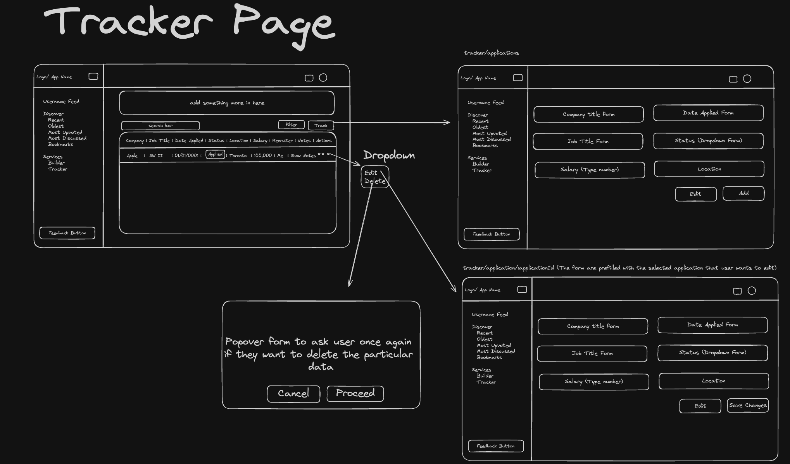

### Data Schema

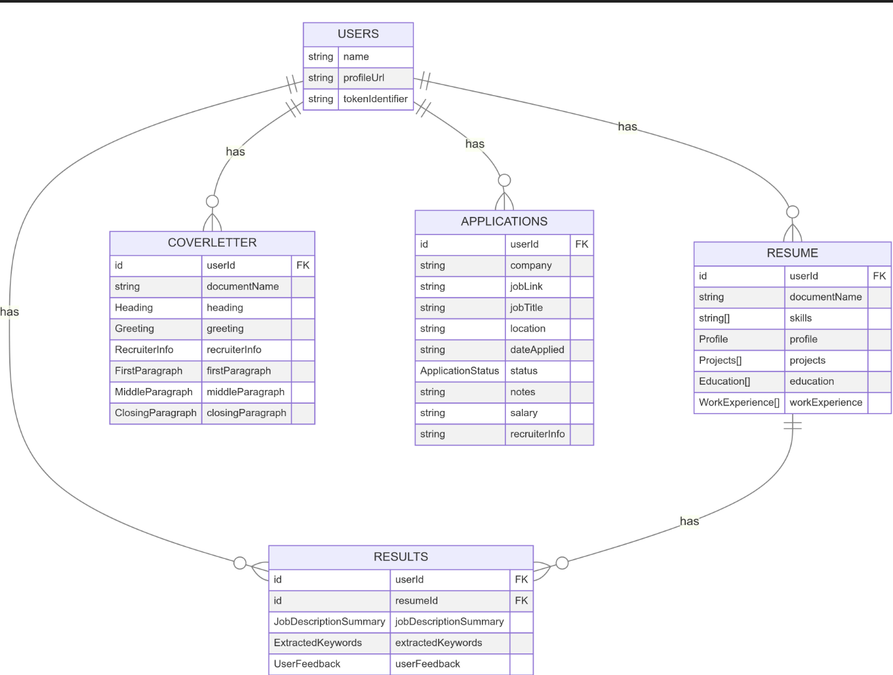

### Server HTTP Methods Functions

#### Fetching & Storing User to the Database

- **Get Self Function**: Fetch current login user.
- **POST /auth.sign-up**: Create new user
  > Both endpoints don't need any parameters and have the same response

RESPONSE: (returns single object)

```
_id: j690v3qbgp5wz7havc97042fcs8v9erq,
_creationTime: 1718490378117.305,
name: John Doe,
tokenIdentifier: https://shiner-dev-30.clerk.accounts.dev|user_0gFlb69T0j8EBOBlBJIOUkfpAAkq
```

#### Builder

**RESUME**

- **GET /builder**: Retrieve documents.
- **PUT or PATCH /builder/resume/:resumeId**: Edit existing document.
  > Both have the same response
  > For the GET request no parameters needed

Parameter:

- resumeId

RESPONSE: (returns single object)

```
_id: j690v3qbgp5wz7havc97042fcs8v9erq,
_creationTime: 1718490378117.305,
userId: 9bc46cb7-b00e-4957-af8b-a817b6355cfd,
documentName: Untitled,
skills: {
    heading: Frontend,
    featuredSkills: HTML, CSS, Javascript,
},
profile: {
    name: John Doe,
    role: Software Engineer,
    email: john.doe@gmail.com,
    phone: 123-456-7890,
    objective: I'm john doe,
    linkedInUrl: www.linkedin.com/in/johndoe,
    githubUrl: www.github.com/johndoe,
},
projects: {
    url: https://johndoe-portfolio.com,
    name: My Portfolio,
    role: Lead Coder,
    date: July 2024,
    industry: BrainStation,
    descriptions: Amazing experience!,
},
education: {
    school: BrainStation,
    degree: Diploma, Software Engineer,
    location: Remote,
    endDate: July 2024,
    startDate: Apr 2024,
},
workExperience: {
    title: Senior Software Developer III,
    company: Google,
    endDate: Present,
    startDate: Sept 2019,
    location: Remote,
    descriptions: Amazing experience!,
},
```

- **POST /builder**: Create new document.

Parameters:

- DocumentName

Response: (returns single object)

```
_id: j690v3qbgp5wz7havc97042fcs8v9erq,
_creationTime: 1718490378117.305,
userId: 9bc46cb7-b00e-4957-af8b-a817b6355cfd,
documentName: Untitled,
skills: null,
profile: null,
projects: null,
education: null,
workExperience: null,
```

- **DELETE /builder**: Delete existing document.

Parameter:

- resumeId

RESPONSE:

```
null
```

#### FETCH & Generate AI Results

- **GET /builder/resume/:resumeId**: Query AI results.
- **POST /builder/resume/:resumeId**: Generate AI feedback.
  > Both have the same response

Parameters(Query AI Result):

- resumeId

Parameters(Generating AI Result):

- jobDescription
- resumePrompt

RESPONSE: (returns single object)

```
_id: Unix Timestamp,
_creationTime: Unix Timestamp,
resumeId: Number,
jobDescriptionSummary: {
	jobPosition: String,
	companyName: String,
	location: String,
	employmentType: Full-Time | Part-Time | Remote,
	responsibilities: String,
	requiredSkills: Array of Strings,
	preferredQualification: String,
	experienceLevel: String,
	educationalRequirements: String,
	salaryRange: String,
	benefits: String
},
extractedKeywords: {
	highImportance: Array of String,
	mediumImportance: Array of String,
	lowImportance: Array of String,
},
userFeedback: {
	missingKeywords: Array of String,
	suggestions: Array of String
}
```

**COVER LETTER**

- **GET /builder**: Retrieve documents.
- **PUT or PATCH /builder/coverLetter/:coverLetterId**: Edit existing document.
  > Both have the same response
  > For the GET request no parameters needed

Parameter:

- resumeId

RESPONSE: (returns single object)

```
_id: j690v3qbgp5wz7havc97042fcs8v9erq,
_creationTime: 1718490378117.305,
userId: 9bc46cb7-b00e-4957-af8b-a817b6355cfd,
documentName: Untitled,
heading: {
    name: John Doe,
    role: Software Engineer,
    email: john.doe@gmail.com,
    phone: 123-456-7890,
    date: 2024-07-14,
    linkedInUrl: www.linkedin.com/in/johndoe,
    githubUrl: www.github.com/johndoe,
},
recruiterInfo: {
    name: Maddy Johnson,
    title: Human Resource,
    companyName: IBM Canada,
    address: 5 Brixby Way
    cityStateZip: Manchester, NH 703444
},
greeting: Dear Mrs. Johnson, ,
firstParagraph: Introduction...,
middleParagraph: Sell yourself...,
closingParagraph: Conclusion...,
```

- **POST /builder**: Create new document.

Parameters:

- DocumentName

Response: (returns single object)

```
_id: j690v3qbgp5wz7havc97042fcs8v9erq,
_creationTime: 1718490378117.305,
userId: 9bc46cb7-b00e-4957-af8b-a817b6355cfd,
documentName: Untitled,
heading: null,
recruiterInfo: null,
greeting: null,
firstParagraph: null,
middleParagraph: null,
closingParagraph: null,
```

- **DELETE /builder**: Delete existing document.

Parameter:

- coverLetterId

RESPONSE: (returns single object)

```
null
```

#### Feeds

- **GET: /feeds**: Retrieve all user feeds.

Parameter: (These are optionals and use for filtering the query)

- bookmarked
- most-upvotes
- most-discussed
- recents (Default)

RESPONSE: (return an array objects)

```
bio: description...,
fileUrl: https://convex-generated-name.convex.cloud/api/storage/:storageId,
username: John Doe,
profImgUrl: https://img.clerk.com/:hashedClerkedId,
userId: 9bc46cb7-b00e-4957-af8b-a817b6355cfd,
fileId: kg26c7ajcmwhr08zba55gvpa817b6355,
tags: ["BrainStation", "SWE", "Be Future Proof"],
upVoteCount: 0,
downVoteCount: 0,
voterIds: v.array(v.object({
    voterId: 9bc46cb7-b00e-4957-af8b-a817b6355cfd,
    voteType: "upvote" | "downvote"
})),
```

- **GET: /feeds/:feedId**: Retrieve a specific feed.

Parameter: (These are optionals and use for filtering the query)

- feedId

RESPONSE: (return single objects)

```
bio: description...,
fileUrl: https://convex-generated-name.convex.cloud/api/storage/:storageId,
username: John Doe,
profImgUrl: https://img.clerk.com/:hashedClerkedId,
userId: 9bc46cb7-b00e-4957-af8b-a817b6355cfd,
fileId: kg26c7ajcmwhr08zba55gvpa817b6355,
tags: ["BrainStation", "SWE", "Be Future Proof"],
upVoteCount: 0,
downVoteCount: 0,
voterIds: v.array(v.object({
    voterId: 9bc46cb7-b00e-4957-af8b-a817b6355cfd,
    voteType: "upvote" | "downvote"
})),
```

- **POST: /feeds**: Create new feed.

Parameter:

- bio
- fileId (Storage ID)
- tags
- profileImgUrl

RESPONSE: (return single object)

```
bio: description...,
fileUrl: https://convex-generated-name.convex.cloud/api/storage/:storageId,
username: John Doe,
profImgUrl: https://img.clerk.com/:hashedClerkedId,
userId: 9bc46cb7-b00e-4957-af8b-a817b6355cfd,
fileId: kg26c7ajcmwhr08zba55gvpa817b6355,
tags: ["BrainStation", "SWE", "Be Future Proof"],
upVoteCount: 0,
downVoteCount: 0,
voterIds: v.array(v.object({
    voterId: 9bc46cb7-b00e-4957-af8b-a817b6355cfd,
    voteType: "upvote" | "downvote"
})),
```

- **PUT or PATCH: /feeds/feedId**: Edit existing and selected feed.

Parameter:

- bio
- fileId (Storage ID)
- tags

RESPONSE:

```
null
```

- **PUT or PATCH: /feeds/feedId**: Voting on existing and selected feed.

Parameter:

- feedId
- voteType

RESPONSE:

```
null
```

- **DELETE: /feeds/feedId**: Deleting existing and selected feed.

Parameter:

- feedId

RESPONSE:

```
null
```

#### Job Tracker

- **GET: /tracker**: Retrieve all user applications.
  > No parameters needed

RESPONSE: (return an array objects)

```
_id: j690v3qbgp5wz7havc97042fcs8v9erq,
_creationTime: 1718490378117.305,
userId: 9bc46cb7-b00e-4957-af8b-a817b6355cfd,
company: Amazon,
jobLink: https://www.linkedin.com/jobs/view/3931258842,
jobTitle: Software Development Engineer, AWS AppFabric,
location: Vancouver, BC,
dateApplied: July 06, 2024,
status: Applied,
notes: The interview is July 14, 2024,
salary: 114,800 - 191,800
recruiterInfo: Bixby Way,
```

- **POST /tracker/application**: Create new application.

Parameters

- company
- jobLink
- jobTitle
- location
- dateApplied
- status
- salary
- recruiterInfo

RESPONSE:

```
_id: j690v3qbgp5wz7havc97042fcs8v9erq,
_creationTime: 1718490378117.305,
userId: 9bc46cb7-b00e-4957-af8b-a817b6355cfd,
company: Amazon,
jobLink: https://www.linkedin.com/jobs/view/3931258842,
jobTitle: Software Development Engineer, AWS AppFabric,
location: Vancouver, BC,
dateApplied: July 06, 2024,
status: Applied,
notes: The interview is July 14, 2024,
salary: 114,800 - 191,800
recruiterInfo: Bixby Way,
```

- **PUT or PATCH /tracker/application/:applicationId**: Update existing application.

Parameters (they will be all optional except applicationId):

- applicationId
- company
- jobLink
- jobTitle
- location
- dateApplied
- status
- salary
- recruiterInfo

RESPONSE:

```
null
```

- **DELETE /tracker**: Delete existing application.

Parameters

- applicationId

RESPONSE:

```
null
```

## Roadmap

- **Create Project using React - NextJS**

  - Install dependencies, set up folder structure and routes.

- **Build ResumeStore for global state management**

  - Implement resume store files.

- **Integrate Clerk Authentication**

  - Create authentication pages and routes.

- **Hook AI with Convex Database**

  - Create node server to use OpenAI with Convex.

- **Build Landing Page**

  - Design and integrate components.

- **Create Global Browser Layout Component**

  - Implement reusable layout.

- **Build Feeds Page**

  - Design and display the card
  - Create a modal for users to create a feed
  - Create a modal for previewing the user posts
  - Add the functionality for other users to upvote, downvote, comment on other users posts.

- **Build Builder Page**

  - Implement document management and creation.
  - Use Tanstack table to display the documents
  - Add buttons to create documents with a pop up modal
  - Add the filter, search, paginate, edit, and delete functionality

- **Build Resume Builder**

  - Build the forms and pdf display separately.
  - Call the resume store to stores all the resume details
  - Integrate AI into the enhancer tab.

- **Build Cover Letter Builder**

  - Build the forms and pdf display separately.
  - Call the cover letter store to stores all the cover letter details

- **Build Tracker Page**

  - Implement job application tracking.
  - Use Tanstack table to display the documents
  - Create routes for the button links for users to create and edit applications
  - Add the filter, search, paginate, edit, and delete functionality

- **Integrate Email JS**

  - Hook the feedback and contact form in EmailJS.

- **Deployment**

  - Deploy application on Vercel.

- **Testing, Styling, Bug Fixes**

  - Ensure application functionality and design.

- **Create Presentation and Demo**

## Nice-to-haves

**Profile Page**

- Build the profile page
- Create a route for profile page
- Ability for users to customer their account profile

**Feeds Page**

- Ability for users to filter through
  - Most recently posts
  - Most discussed
  - Most upvoted
  - bookmarked
- Apply infinite scroll to the page
- Add the ability for users to invite other users
- Add the ability for users to bookmarked other users posts
- Rebuild the functionality for commenting and like in the database

**Builder Page**

- Add an ability for users to change theme color, font, and pdf style fron resume and cover letter.
- Upload and parse resume/cover letter
- Improve the AI feedback mechanism on resume builder
- Fine tune your AI model to get better results
- Add samples for users to look at

**Extra Features**

- Use Jest for testing
- Integrate Gamification
- Create Dashboard to track their performance
- Implement Interview Prep and Career Path Generator
- Add Calendar feature where users can set up appointments
