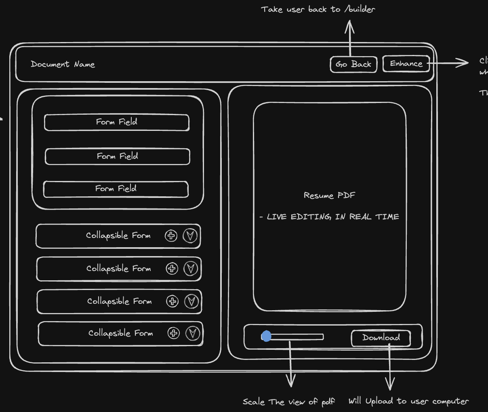

# Project Title

**Hireme**

## Overview

Hireme simplifies and enhances the job application process for job seekers.

### Problem

Job hunting can be one of the most stressful experiences, especially for recent graduates or those re-entering the workforce. Crafting a compelling resume and cover letter is crucial, yet many struggle with this daunting task. The anxiety of rejections, coupled with the challenge of creating standout application documents, can be overwhelming. Hireme addresses these challenges with a versatile tool designed to support every aspect of the job application process.

### User Profile

**Job Seekers:**

- Create compelling resumes and cover letters using the builder tool.
- Enhance application documents with tailored feedback based on job descriptions.
- Engage with a supportive community to share job application journeys and receive encouragement.
- Track and organize job applications, updating statuses to stay organized.
- Appreciate a clean and intuitive UI.

### Features

- **Private Workspace**: Protect privacy with dedicated personal workspaces.
- **Document Management**: View, filter, sort, search, and paginate drafted documents.
- **Resume Builder**: Create resumes using an intuitive builder tool.
- **AI Enhancer**: Analyze and improve resumes based on job descriptions.
- **Job Application Tracker**: Track applications with an interactive table.
- **Application Status Updates**: Easily update application statuses.
- **Organized Job Application Lists**: Stay on top of job search progress.

## Implementation

### Tech Stack

**Framework:**

- Next.js

**Front-End:**

- React
- TypeScript
- TailwindCSS
- Shadcn-UI Library

**Database:**

- Convex

**Authentication:**

- Clerk

**AI Model:**

- Gemini API

**Client Libraries:**

- Framer Motion (animation)
- React-PDF/renderer (PDF rendering)
- PDFJS (PDF conversion)
- Lucide React (icons)
- React Hook Form (form library)
- Zod (form validation)
- Zustand (global state management)
- Tanstack React-Table (table component)

**Deployment:**

- Vercel

### APIs

- Gemini API
- Clerk
- Convex

### Sitemap

#### Landing

- **Landing Page**: `/`
  - Sections: Header, Hero, Features, BentoGridFeatures, Highlights, CTA, Footer

#### Auth

- **Sign-In**: `/auth/sign-in/[[...sign-in]]`
- **Sign-Up**: `/auth/sign-up/[[...sign-up]]`

#### Feeds

- **User Feeds**: `/feeds/:userId`
  - Homepage for authenticated users.
  - Public resume sharing.
  - Interaction features: upvote, downvote, comment.

#### Builder

- **Document List**: `/builder`
  - Main page listing all drafted documents.
  - Toggle between Resume and Cover Letter.
  
- **Resume Builder**: `/builder/resume/:resumeId`
  - Real-time updates as users fill out forms.
  - Enhancement button for AI feedback.

#### Tracker

- **Job Tracker Main Page**: `/tracker`
  - Interactive table for tracked job applications.
  - Filter, search, and pagination features.
  
- **New Application**: `/tracker/application`
  - Page for creating new job applications.
  
- **Edit Application**: `/tracker/application/:applicationId`
  - Page for editing existing job applications.

### Mockups

#### Landing Page

- **Header & Hero**
  

- **Features**
  

- **Call to Action (CTA)**
  

- **Footer**
  

#### Feeds Page


#### Builder Page

- **Builder Main Page**
  

- **Resume Builder Main Page**
  

- **Enhance Tab**
  

- **Stepper Form**
  

#### Job Tracker Page


### Data Schema


### Server HTTP Methods Functions

#### Fetching & Storing User to the Database

- **Get Self Function**: Fetch current login user.
- **POST /auth.sign-up**: Create new user
> Both endpoints don't need any parameters and have the same response

RESPONSE:
```
_id: j690v3qbgp5wz7havc97042fcs8v9erq,
_creationTime: 1718490378117.305,
name: John Doe,
tokenIdentifier: https://prompt-shiner-30.clerk.accounts.dev|user_0gFlb69T0j8EBOBlBJIOUkfpAAkq
```

#### Job Tracker

- **GET: /tracker**: Retrieve all user applications.
> No parameters needed

RESPONSE:
```
_id: j690v3qbgp5wz7havc97042fcs8v9erq,
_creationTime: 1718490378117.305,
userId: 9bc46cb7-b00e-4957-af8b-a817b6355cfd,
company: Amazon,
jobLink: https://www.linkedin.com/jobs/view/3931258842,
jobTitle: Software Development Engineer, AWS AppFabric,
location: Vancouver, BC,
dateApplied: July 06, 2024,
status: Applied,
notes: null,
salary: 114,800 - 191,800
recruiterInfo: null,
```

- **POST /tracker/application**: Create new application.

Parameters
- company
- jobLink
- jobTitle
- location
- dateApplied
- status
- salary
- recruiterInfo

RESPONSE:
```
_id: j690v3qbgp5wz7havc97042fcs8v9erq,
_creationTime: 1718490378117.305,
userId: 9bc46cb7-b00e-4957-af8b-a817b6355cfd,
company: Amazon,
jobLink: https://www.linkedin.com/jobs/view/3931258842,
jobTitle: Software Development Engineer, AWS AppFabric,
location: Vancouver, BC,
dateApplied: July 06, 2024,
status: Applied,
notes: null,
salary: 114,800 - 191,800
recruiterInfo: null,
```

- **PUT or PATCH /tracker/application/:applicationId**: Update existing application.

Parameters (they will be all optional except applicationId):
- applicationId
- company
- jobLink
- jobTitle
- location
- dateApplied
- status
- salary
- recruiterInfo

RESPONSE:
```
_id: j690v3qbgp5wz7havc97042fcs8v9erq,
_creationTime: 1718490378117.305,
userId: 9bc46cb7-b00e-4957-af8b-a817b6355cfd,
company: Amazon,
jobLink: https://www.linkedin.com/jobs/view/3931258842,
jobTitle: Software Development Engineer, AWS AppFabric,
location: Vancouver, BC,
dateApplied: July 06, 2024,
status: Applied,
notes: null,
salary: 114,800 - 191,800
recruiterInfo: null,
```

- **DELETE /tracker**: Delete existing application.

Parameters
- applicationId

RESPONSE:
```
null
```

#### Builder

- **GET /builder**: Retrieve documents.
- **PUT or PATCH /builder/resume/:resumeId**: Edit existing document.
> Both have the same response
> For the GET request no parameters needed

Parameter:
- resumeId

RESPONSE:
```
_id: j690v3qbgp5wz7havc97042fcs8v9erq,
_creationTime: 1718490378117.305,
userId: 9bc46cb7-b00e-4957-af8b-a817b6355cfd,
documentName: Untitled,
skills: {
    heading: Frontend,
    featuredSkills: HTML, CSS, Javascript,
},
profile: {
    name: John Doe,
    role: Software Engineer,
    email: john.doe@gmail.com,
    phone: 123-456-7890,
    objective: I'm john doe,
    linkedInUrl: www.linkedin.com/in/johndoe,
    githubUrl: www.github.com/johndoe,
},
projects: {
    url: https://johndoe-portfolio.com,
    name: My Portfolio,
    role: Lead Coder,
    date: July 2024,
    industry: BrainStation,
    descriptions: Amazing experience!,
},
education: {
    school: BrainStation,
    degree: Diploma, Software Engineer,
    location: Remote,
    endDate: July 2024,
    startDate: Apr 2024,
},
workExperience: {
    title: Senior Software Developer III,
    company: Google,
    endDate: Present,
    startDate: Sept 2019,
    location: Remote,
    descriptions: Amazing experience!,
},
```

- **POST /builder**: Create new document.

Parameters:
- DocumentName

Response:
```
_id: j690v3qbgp5wz7havc97042fcs8v9erq,
_creationTime: 1718490378117.305,
userId: 9bc46cb7-b00e-4957-af8b-a817b6355cfd,
documentName: Untitled,
skills: null,
profile: null,
projects: null,
education: null,
workExperience: null,
```

- **DELETE /builder**: Delete existing document.

Parameter:
- resumeId

RESPONSE:
```
null
```

#### FETCH & Generate AI Results

- **GET /builder/resume/:resumeId**: Query AI results.
- **POST /builder/resume/:resumeId**: Generate AI feedback.
> Both have the same response


Parameters(Query AI Result):
- resumeId 

Parameters(Generating AI Result):
- jobDescription
- resumePrompt

RESPONSE:
```
_id: Unix Timestamp,
_creationTime: Unix Timestamp,
resumeId: Number,
jobDescriptionSummary: {
	jobPosition: String,
	companyName: String,
	location: String,
	employmentType: Full-Time | Part-Time | Remote,
	responsibilities: String,
	requiredSkills: Array of Strings,
	preferredQualification: String,
	experienceLevel: String,
	educationalRequirements: String,
	salaryRange: String,
	benefits: String
},
extractedKeywords: {
	highImportance: Array of String,
	mediumImportance: Array of String,
	lowImportance: Array of String,
},
userFeedback: {
	missingKeywords: Array of String,
	suggestions: Array of String
}
```

## Roadmap

- **Create Project using React - NextJS**
  - Install dependencies, set up folder structure and routes.

- **Build ResumeStore for global state management**
  - Implement resume store files.

- **Integrate Clerk Authentication**
  - Create authentication pages and routes.

- **Hook AI with Convex Database**
  - Synchronize user data.

- **Build Landing Page**
  - Design and integrate components.

- **Create Global Browser Layout Component**
  - Implement reusable layout.

- **Build Feeds Page**
  - Develop feed components.

- **Build Builder Page**
  - Implement document management and creation.

- **Build Resume Builder**
  - Develop resume creation and AI integration.

- **Build Enhance Tab**
  - Implement AI feedback feature.

- **Build Tracker Page**
  - Implement job application tracking.

- **Deployment**
  - Deploy application on Vercel.

- **Testing, Styling, Bug Fixes**
  - Ensure application functionality and design.

- **Create Presentation and Demo**

## Nice-to-haves

- **Integrate Sentry for error tracking**
- **Use Jest for testing**
- **Implement Cover Letter Builder**
- **Add Calendar feature**
- **Implement Interview Prep and Career Path Generator**
- **Upload and parse resume/cover letter**
- **Create Dashboard for analytics**
- **Integrate Gamification**
- **Add caching mechanism**

